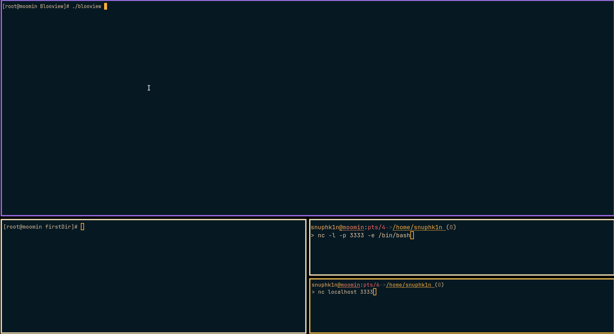

# BlooView
Filesystem and Network Monitoring Tool For Linux that runs within a Terminal.

# Demo

# Installation
- Install Golang
- Clone the repo
`git clone https://github.com/biplavxyz/blooview`
- Create blooview config path
`mkdir -p ~/.config/blooview; touch ~/.config/blooview/blooview.toml`
- Build and run
`make build`
`sudo ./bin/blooview`

# BPF Setup
- `make all`

# Cleanup
- `make clean`

# Progress
- [x] Display filesystem changes.
- [x] Display established network connection information.
- [x] Execve Syscall monitoring by tracing `sys_enter_execve`.
- [ ] PTR lookup for IP addresses under established connections.
- [ ] Display live commands being run by established net process.
- [ ] Write tests.
